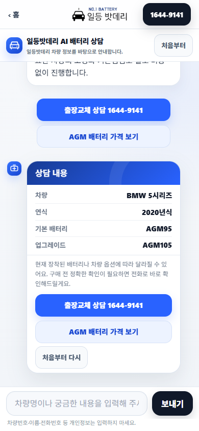
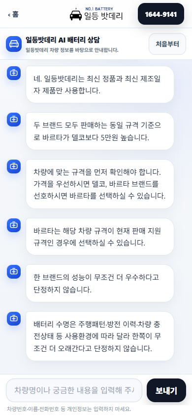
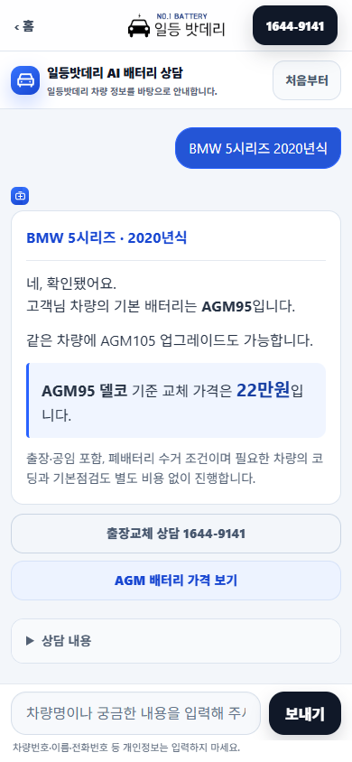
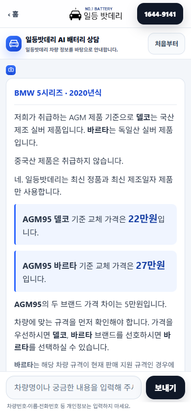
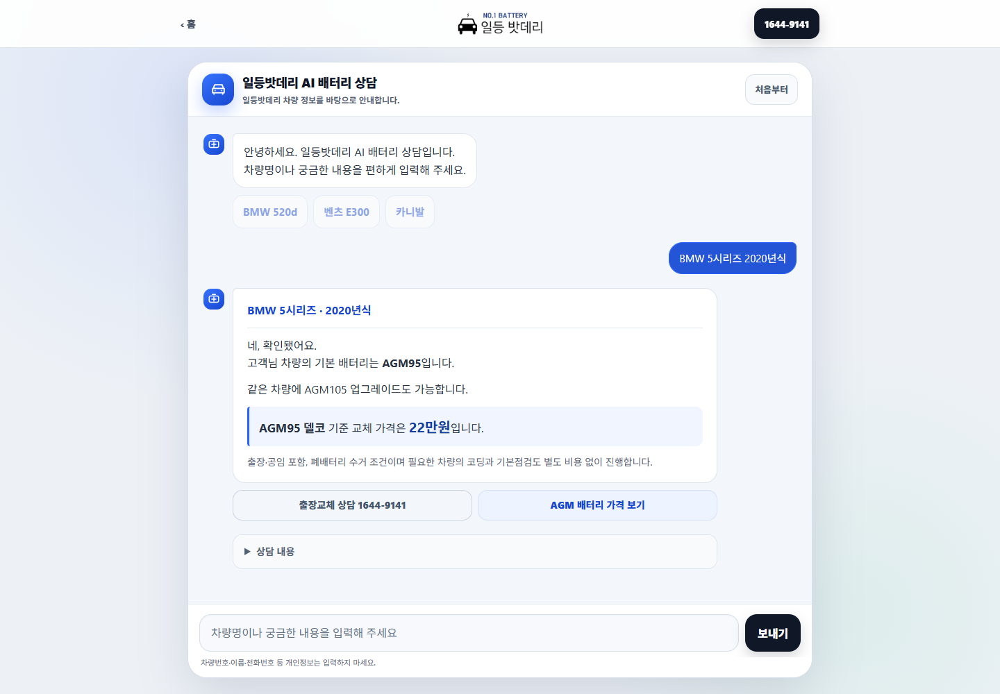
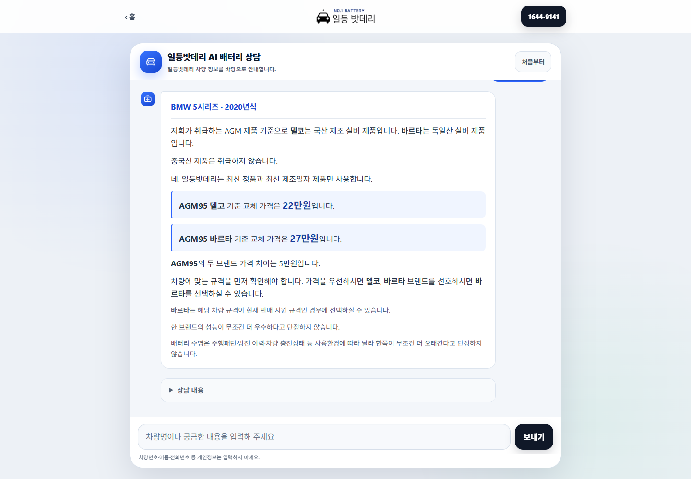

# Professional consultation UI — predeployment evidence

Baseline: `eb10f9f516ee85e384cd8b01e0e53f7098382034`. Branch main; local/origin/actual remote matched, 0/0, clean before edits. No push or deployment authorized or performed.

## Before audit (actual local browser, 1440×1000 and 390×844)

10 captured scenarios: cash FAQ, BMW price, generic comparison, realtime question, G90 candidates at each width. Before: assistant 15px/24.3px; candidate 14px/44px; each answer sentence was a separate narrow bubble with repeated avatar/shadow; unconditional 300ms presentation wait affected even cash/authenticity FAQ. Vehicle price was pushed out of view by expanded summary and repeated primary phone CTAs. Input was already 16px and mobile 48px high, so retained.

## Presentation-only changes

- One complete response per wide article; original message paragraphs and character content preserved. No typewriter, no summaries replacing policy text.
- Vehicle/year header from existing canonical summary fields only when the quoted specification equals the confirmed fitment. A standalone different specification in remembered vehicle context receives no fitment header.
- Prices decorated only by exact equality with `priceDescription` output from existing canonical catalog. No monetary regex extraction, copied price truth, new fitment rules, or intent changes.
- Brand/code tokens emphasized as lossless text-node spans. MINI keeps every component and field-confirmation text; unsupported VARTA text remains unchanged.
- Current consultation summary uses native details/summary, initially closed. Original summary fields and CTA destinations remain available.
- Phone is secondary for known prices/information and primary for existing responses requiring exact/realtime confirmation; no routing or href changes. Restored prices stay secondary.
- New answers start in view; user reading position is not repeatedly forced. Composer, viewport adapter, safe-area and launcher logic are unchanged.

## Typography and geometry

Customer 15px/24px; assistant 16px/25.6px; canonical vehicle heading16px/25.6px semibold; price code/brand17px semibold; amount20px bold; conditions14px/22.4px; candidate15px/22.5px. Mobile G90 candidate hit boxes366×48.5px; input277×48px and send80×48px. Desktop input/send54px high. Mobile answer card366px wide (332px inner text), versus the previous narrow bubble gutter. Candidate focus-visible/pressed state; native summary keyboard support.

## Timing/accessibility

- Only an actual new vehicle/spec-price/area lookup or candidate selection receives a textual role=status cue. Deterministic presentation budget is300ms minus real work already elapsed, max300ms. No new region feedback merely because a previous region exists during a realtime FAQ.
- Cash/authenticity/reservation/today/exact-date FAQs: zero artificial wait; measured warm browser samples approximately14–29ms. Lookup samples approximately307–336ms including rendering.
- Complete text appears at once.180ms/3px entrance slide (no opacity-hidden text); reduced-motion disables animation and lookup presentation wait.
- Sampled actual text contrast minimum6.27:1; focus-visible, Enter submission, reset during delay, normal scroll preservation, and restored neutral price CTA passed.
-390px browser keyboard-contracted viewport emulation390×480 passed (input remains visible, body scroll0). This is desktop-browser viewport emulation, not a physical iOS/Android keyboard claim.

## Validation

- Focused presentation assertions: canonical30 price lines; lossless text, no artificial FAQ delay across fresh/vehicle/area/brand/pending-selection contexts, correct CTA emphasis, reduced motion, scope/HTML freeze.
- Brand625; operational FAQ1,602; authentic/manufacture/cash581; standalone178 (130 canonical cases): all PASS, all existing hard gates0.
- Authoritative full regression20/20 PASS. Historical HTML tests updated only for the two approved CSS/JS cache tokens; no expectation weakening for data, policy, SEO, body or hrefs.
- Selection499groups/1,277buttons:1,273 exact rows +4 governed no-match, all failure categories0. Session/security33turns and19 tampered selections rejected, all6 hard gates0.
- Actual browser UI suite: desktop114records; mobile116records. Each viewport clicked every A7/G80/G90 candidate (6). Every fresh rendered answer's paragraph text equals the unchanged engine response exactly; session state equals engine state. MINI/unsupported/prices/multi-turn/reentry/reduced-motion included.
- Additional native Enter/Tab interaction, timing, contrast, reset cancellation and standalone-header checks at both widths passed.
- `TYPEWRITER_EFFECT_PRESENT=0`, `RANDOM_FAKE_DELAY_PRESENT=0`, `SIMPLE_FAQ_ARTIFICIAL_DELAY=0`, `LOOKUP_PRESENTATION_DELAY_OVER_600MS=0`.

## Exact functional answers (unchanged)

Cash: “네. 현금결제 가능합니다.”

BMW: “네, 확인됐어요.\n고객님 차량의 기본 배터리는 AGM95입니다.” / “같은 차량에 AGM105 업그레이드도 가능합니다.” / “AGM95 델코 기준 교체 가격은 22만원입니다.” / “출장·공임 포함, 폐배터리 수거 조건이며 필요한 차량의 코딩과 기본점검도 별도 비용 없이 진행합니다.”

Reservation: “예약·신청·접수는 고객센터 1644-9141로 문의해 주세요. 이 채팅에서는 예약을 확정하지 않습니다.”

Today: “지금·오늘 방문 가능 여부와 도착 시간은 실시간 확인이 필요해요. 1644-9141로 전화주시면 가능한 시간을 확인해드릴게요.”

Exact manufacture: “항상 최신 제조일자 제품만 사용합니다. 정확한 현재 제품의 제조일자·출고일·입고일은 제품 확인이 필요하므로 고객센터 1644-9141로 확인해 주세요.”

All comparison answers/candidate identities, browser dimensions and timing samples are retained in `audit.json`.

## Freeze

917 vehicle rows,665 supported areas; canonical vehicle/area/price/policy files and conversation engine unchanged. Protected homepage/vehicle/area/battery HTML unchanged; consultation HTML differs only in its two CSS/JS cache query versions. Title/H1/canonical/schema/body/href content unchanged. BLOG_COUNT345; SITEMAP_URL_COUNT1133. No generated vehicle/area HTML diff; no SEO/GEO/blog content diff.

## After screenshots

## Reproduce

`node tools/test-consult-presentation.js`

`node tools/test-consult-presentation-browser.js` with `AGENT_BROWSER_BIN` and `UAT_WIDTH=1440` or390 (warm the named `consult-ui-<width>` browser once first).

`node tools/test-consult-presentation-interaction.js` (warm `consult-ui-interaction` first).

During this run generated legacy test logs were redirected outside the repository to avoid changing historical evidence. Browser originals and full regression output: `C:/Users/kang1/AppData/Local/Temp/ildeung-brand-deploy/evidence/`.
